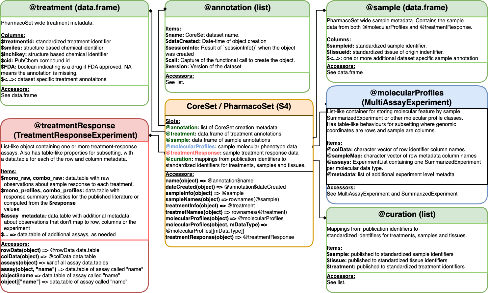

```{r, include = FALSE} 
knitr::opts_chunk$set(
  collapse = TRUE,
  comment = "#>"
)
```

```{r eval=TRUE, echo=FALSE}
PGx <- BiocStyle::Biocpkg("PharmacoGx")
CGx <- BiocStyle::Biocpkg("CoreGx")
TGx <- BiocStyle::Biocpkg("ToxicoGx")
RGx <- BiocStyle::Biocpkg("RadioGx")
Xv <- BiocStyle::Biocpkg("Xeva")
DT <- BiocStyle::CRANpkg("data.table")
SE <- BiocStyle::Biocpkg("SummarizedExperiment")
MAE <- BiocStyle::Biocpkg("MultiAssayExperiment")
```


# Lab 2 Overview {-}

## Instructor(s) name(s) and contact information {-}

* Jermiah J. Joseph <jermiah.joseph@uhn.ca>
* Almas Khan <almas.khan@mail.utoronto.ca>
* Julia Nguyen <julia.nguyen@uhn.ca>

## Lab Description {-}

<!-- Lab Practical – Hands-on with pharmacogenomics data  (Jermiah Joseph, Almas Khan)

Loading a PharmacoSet in R using PharmacoGx or ORCESTRA, understanding the data structure, accessing features, and preparing metadata
Plot batch effects using PCA and run correction method (SVA)
Filter out outliers and missing values -->

### Learning goals {-}

* Understand the data structure of a `PharmacoSet`
* Learn how to access features and metadata from a PharmacoSet
* Learn how to plot batch effects using PCA and run correction method (SVA)
* Learn how to filter out outliers and missing values

### Learning objectives {-}

* Describe the use cases for `r PGx` in Pharmacogenomics
* Understand the structure of the `CoreSet` and `PharmacoSet` classes to facilitate their use in subsequent analyses
* Download/load a `PharmacoSet` using `r PGx` or [orcestra.ca](https://orcestra.ca)
* Subset and filter a `PharmacoSet` by samples and/or treatments
* Access the molecular features, dose-response and metadata contained within the `PharmacoSet`

----

```{r global_knitr_opts, echo=FALSE}
knitr::opts_chunk$set(
  echo = TRUE, include = TRUE, warning = FALSE, message = TRUE
)
```

```{r load_packages, eval=TRUE, echo=FALSE, include=FALSE}
suppressPackageStartupMessages({
  library(CBWWorkshop2024)
  library(PharmacoGx)
  library(data.table)
})
```


# Setup

## Use Cases for `r PGx`

*Downloading Data from [orcestra.ca](https://orcestra.ca)*

```{r get_avail_psets}
available <- PharmacoGx::availablePSets() |>
  data.table::as.data.table()

print(names(available))

print(available[, c("Dataset Name", "PSet Name", "version")])
```

The following function from `r PGx` can be used to download any of the available PSets from [orcestra.ca](https://orcestra.ca).

The command to do so is:
``` {r download_pset_orcestra, eval=FALSE}
PharmacoGx::downloadPSet(
  name = "CCLE_2015",
  saveDir = "../psets", # change this directory as you see fit
  timeout = 3600,
  verbose = TRUE
)

# Note: this may take a while to download as the files are stored in 
# zenodo and are quite large
```

For convenience and in the interest of time, we have created a `PharmacoSet` to be used 
in this tutorial. We will be interacting with this dataset for the remainder of the tutorial.

```{r load_pset}
pset <- CBWWorkshop2024::dummy_pset
pset
```

# Understanding `PharmacoSet` the Data Structure

The `PharmacoSet` class is a container for pharmacogenomic data. 

This pharmacogenomic data is typically generated from high-throughput
screening experiments where cell lines are treated with a panel of drugs at multiple doses and the response is measured using a molecular assay.

```{r show_pset_structure}
slotNames(pset)
```


```{r core_set_class, echo=FALSE, fig.wide=TRUE, fig.cap = "**PharmacoSet** class structure" }

```

# Metadata 

Metadata for cell-lines (`samples`) and drugs (`treatments`) are stored in 
the `sample` and `treatment` slots, respectively.

These are data frames with rows corresponding to samples or treatments and 
columns corresponding to metadata fields. The metadata fields are typically a 
combination of data from the original data source, and curated data from 
external sources such as [Cellosaurus](https://web.expasy.org/cellosaurus/),
[DrugBank](https://go.drugbank.com/), and [PubChem](https://pubchem.ncbi.nlm.nih.gov/).

## View the `sample` slot

We can access the `sampleNames` of the `PharmacoSet`:

```{r show_sample_names}
PharmacoGx::sampleNames(pset)
```

To get all the metadata associated with the samples, we can access the `sample` slot:
```{r show_samples}
pset@sample |> str()
```
We can see from the `sample` slot that there are 50 samples in this `PharmacoSet`.

## View the `treatment` slot

Similar to the `sample`, we can access the `treatmentNames` of the `PharmacoSet`:

```{r show_treatment_names}
PharmacoGx::treatmentNames(pset) |> head()
```

To get all the metadata associated with the treatments, we can access the `treatment` slot:

```{r show_treatments}
pset@treatment |> str()
```
There are also 22 treatments used.


# Molecular Profiles

In `r PGx`, molecular profiles refer to any data that is measured on the 
samples in the `PharmacoSet`. This can include gene expression, 
copy number, mutation, or any other type of data that can be measured on 
a sample.

Each Molecular Data Type (`mDataType`) is stored in a `SummarizedExperiment`.
All the `SummarizedExperiment` objects are stored in a container called
a `MultiAssayExperiment` which can be accessed through the 
`molecularProfiles` slot.

## View the `molecularProfiles` slot

```{r show_molecular_profiles}
pset@molecularProfiles
```


# Treatment Response

The treatment response data was traditionally stored in a `list`. To accelerate
analysis, we have developed a new class called the `TreatmentResponseExperiment`
(TRE) which has been specifically designed to handle high dimensional biological
stimulus-response data.

@jermiah ADD DIAGRAM OF TRE CLASS

## View the `treatmentResponse` slot

```{r show_treatment_response}
pset@treatmentResponse
```

To view all the methods available for the `TreatmentResponseExperiment` class,
we can use the `methods` function:

```{r show_tre_methods}
methods(class = "TreatmentResponseExperiment")
```

# Subsetting a `PharmacoSet`


### Subset by `sampleNames` and/or `treatmentNames`

When subsetting a `PharmacoSet` object by `sample` names, both the 
`MultiAssayExperiment` and `TreatmentResponseExperiment` objects will be 
subsetted so all their internal `Experiments` only contain data for the samples
of interest.

However, when subsetting by `treatment` names, only the `TRE` object will be 
subsetted. 


```{r subset_pset}
PharmacoGx::subsetBySample(
  pset,
  sample = sampleNames(pset)[1:5]
)

PharmacoGx::subsetByTreatment(
  pset,
  treatment = treatmentNames(pset)[1:5]
)
```

### Subsetting using `sample` and `treatment` metadata

The utility of the `metadata` slots in the `PharmacoSet` class 

```{r subset_pset_metadata, warning=FALSE}
unique(pset@sample$tissueid)

tissues_of_interest <- c("Kidney")
indices <- which(pset@sample$tissueid %in% tissues_of_interest)


(samples_of_interest <- sampleNames(pset)[indices])

PharmacoGx::subsetBySample(
  pset,
  samples_of_interest
)
```


A concise way to subset by `sample` in one step:

```{r subset_pset_metadata2, warning=FALSE}
PharmacoGx::subsetBySample(
  pset,
  sample = pset@sample[
    pset@sample$tissueid == "Kidney",
    "sampleid"
  ]
)
```

# Computing over a `TreatmentResponseExperiment`

The `TreatmentResponseExperiment` class has been designed to facilitate
more than just storing data efficiently. Once the data is curated and
stored safely inside our object, we are ready to start answering questions.

First, lets extract the `TRE` to work with:

```{r extract_tre}

tre <- pset@treatmentResponse
show(tre)
```


## Aggregating over the `TreatmentResponseExperiment`

The `aggregate` function is a powerful tool that allows us to summarize the
data in a `TreatmentResponseExperiment` object.


```{r tre_aggregate_example}
tre  |>
  aggregate(
      assay="sensitivity",
      N=.N,
      by=c("treatmentid", "treatmentdose", "sampleid", "bio_rep")
  ) 
```

You can also use the `subset` function to subset the `TreatmentResponseExperiment` object
before performing an `aggregate`.

Additionally, you can even `subset` over the result of an `aggregate` operation.

```{r tre_aggregate_example2}
tre |> 
  subset(treatmentid %in% c("Doxorubicin", "Ixabepilone")) |>
  aggregate(
      assay="sensitivity",
      N=.N,
      by=c("treatmentid", "treatmentdose", "sampleid", "bio_rep")
  ) |>
  subset(N>1 & sampleid =="A-498")

```


### Plotting the number of replicates

The last two examples have shown that there are technical replicates in the data.
We can visualize the number of replicates using a histogram.

```{r tre_aggregate}

tre  |>
  aggregate(
      assay="sensitivity",
      N=.N,
      by=c("treatmentid", "treatmentdose", "sampleid", "bio_rep")
  ) |>
  with(expr=hist(N, main="Histogram of Number of Replicates", xlab="Number of Replicates"))
```

@Julia do we want to plot the technical replicates for a specific treatment? 

idk if that applies here but

### Summarize over technical replicates

Depending on the experiment design, you will need to choose how you want to 
proceed with the data.

In the interest of computation time, we want to summarize the technical replicates
into a single value and store that result **inside** the `TreatmentResponseExperiment`.

For this, we have developed the `endoaggregate` method. 

This method will perform similar to the `aggregate` method, but will return a 
`TreatmentResponseExperiment` object with the summarized data as another assay.

```{r tre_endoaggregate}
new_tre <- tre  |>
  endoaggregate(
      N=.N,
      assay="sensitivity",
      target="tech_rep_counts",
      by=c("treatmentid", "treatmentdose", "sampleid", "bio_rep")
  ) 
show(new_tre)
head(new_tre$tech_rep_counts[order(-N)])
```

Lets use this method to summarize the technical replicates by taking the mean
of the `viability` values for each unique combination of `treatmentid`, `treatmentdose`, `sampleid`, and `bio_rep`.

```{r tre_endoaggregate2}
tre_avged <- tre  |>
  endoaggregate(
      viability=mean(viability),
      assay="sensitivity",
      target="mean_sensitivity",
      by=c("treatmentid", "treatmentdose", "sampleid", "bio_rep")
)
str(tre_avged$mean_sensitivity)
```

### A nice subheading for computing AAC, IC50 etc.

```{r tre_endoaggregate3, warning=FALSE}

tre_profiled <- tre_avged |> 
  endoaggregate(
    {
      fit <- PharmacoGx::logLogisticRegression(treatmentdose, viability)
      IC50 <- PharmacoGx::computeIC50(treatmentdose, Hill_fit = fit)
      AAC <- PharmacoGx::computeAUC(treatmentdose, Hill_fit = fit, area.type = "Fitted")
      list(
        HS = fit[["HS"]], E_inf = fit[["E_inf"]]/100, EC50 = fit[["EC50"]],
        Rsq = as.numeric(unlist(attributes(fit))),
        AAC = AAC,
        IC50 = IC50
      )
    },
    assay="mean_sensitivity",
    subset= treatmentid %in% rowData(tre_avged)[,unique(treatmentid)][1:3],
    by = c("treatmentid", "sampleid", "bio_rep"),
    enlist=FALSE,
    target="profiles"
)
```

If we didn't subset the `TRE` this computation will have taken a while since
it is a computationally intensive operation and run on a single thread.

Under the hood, the `CoreGx` package performs the aggregation. 
To speed up computation, it provides an `nthread` parameter to parallelize the
computation.

To determine a safe, and optimal number of threads to use, we can use the
`CoreGx::optimizeCoreGx` function which will tell us a safe number of threads.

```{r determine_nthreads, warning=FALSE}

CoreGx::optimizeCoreGx(tre_avged)
```

Depending on your device, this number may vary.
Let's use a conservative number of threads for this example.

```{r tre_endoaggregate4, warning=FALSE}

tre_profiled <- tre_avged |> 
  endoaggregate(
    {
      fit <- PharmacoGx::logLogisticRegression(treatmentdose, viability)
      IC50 <- PharmacoGx::computeIC50(treatmentdose, Hill_fit = fit)
      AAC <- PharmacoGx::computeAUC(treatmentdose, Hill_fit = fit, area.type = "Fitted")
      list(
        HS = fit[["HS"]], E_inf = fit[["E_inf"]]/100, EC50 = fit[["EC50"]],
        Rsq = as.numeric(unlist(attributes(fit))),
        AAC = AAC,
        IC50 = IC50
      )
    },
    assay="mean_sensitivity",
    by = c("treatmentid", "sampleid", "bio_rep"),
    enlist=FALSE,
    target="profiles",
    nthread=6
)
```

Lets look at the profiles we have computed:

```{r tre_profiled}

tre_profiled$profiles
```

@Julia what can I do with these? can I plot or something cool?


